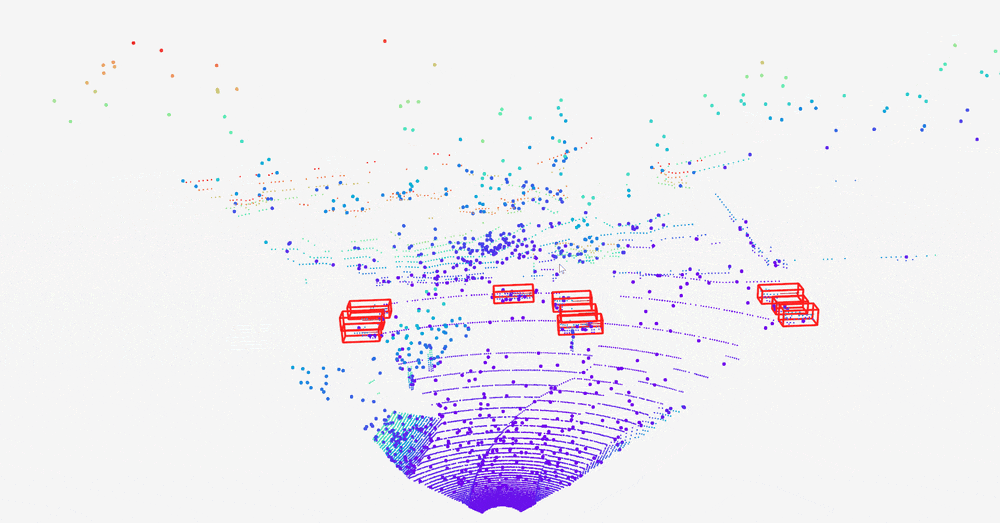

# Cooperative Perception 3D Viewer 
This project was developed to provide a multi-agent 3D visualization tool for collaborative perception of 3D object detection tasks.

本项目旨在为协同感知三维目标检测任务提供多智能体3D可视化工具。

<p align="center">

</p>

## Installation
1. Install python3.9
2. Install required environment
```
pip install numpy==1.21.1 vedo==2021.0.7 vtk==9.4.1 opencv-python==4.6.0.66 matplotlib shapely tensorflow pyyaml -i https://pypi.tuna.tsinghua.edu.cn/simple
pip install torch==1.11.0+cpu torchvision==0.12.0+cpu torchaudio==0.11.0 --extra-index-url https://download.pytorch.org/whl/cpu
```
3. Clone this depository
```
git clone https://github.com/ylwhxht/Cooperative_Perception_3D_Viewer.git
cd Cooperative_Perception_3D_Viewer
```
## Usage
### 1. Prepare data (数据准备)

将每个智能体的点云数据（激光雷达、4D毫米波雷达）、传感器配置文件放置到同一文件夹下（从0开始命名），可以参考demo文件夹。
       
Place the point cloud data (LiDAR, 4D millimeter wave radar) and sensor configuration yaml files of each agent in folder (named start 0) as (refer to the [demo](https://github.com/ylwhxht/Cooperative_Perception_3D_Viewer/tree/main/demo)):

```
0_lidar.pcd
0_radar.pcd
0.yaml
1_lidar.pcd
1_radar.pcd
1.yaml
...
```

### 2. Parameter settings (参数设置)
修改coop_3D_viewer.py代码中`Parameter settings here`的部分

Modify the 'Parameter settings here' section in the code 'cook-3D_viewer.py'

### 3. Run (运行)
```
python coop_3D_viewer.py
```

启用可视化之后按q（英文输入法状态下）切换到下一帧。

After running coop_3D_viewer, press q (in English input method mode) to switch to the next frame.

## Acknowledgment

感谢[3D_Object&Tracking_viewer](https://github.com/hailanyi/3D-Detection-Tracking-Viewer)提供的三维目标检测3D可视化代码以及[OpenCOOD](https://github.com/DerrickXuNu/OpenCOOD)提供的多智能体点云、检测框坐标系变换代码。

如果您想自定义可视化代码，还可以在这些存储库中找到有关函数调用技术的更详细文档。当然，欢迎对困惑的相关代码部分提出issue。


Thanks for [3D_Object&Tracking_Viewer](https://github.com/hailanyi/3D-Detection-Tracking-Viewer) providing for related code about 3D object detection and visualization  as well as [OpenCOOD](https://github.com/DerrickXuNu/OpenCOOD) providing for related code about  multi-agent point cloud and detection box coordinate system transformation.


If you want to customize visualization code, more detailed documentation on function calling techniques can also be found in these repositories.
Of course, feeling free to raise issues.
